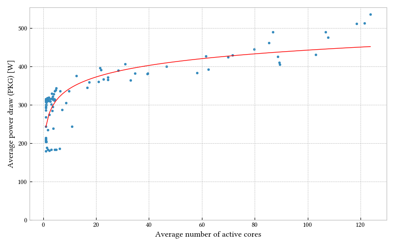
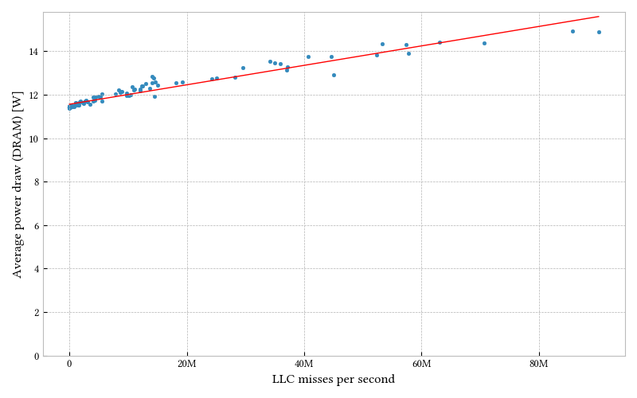
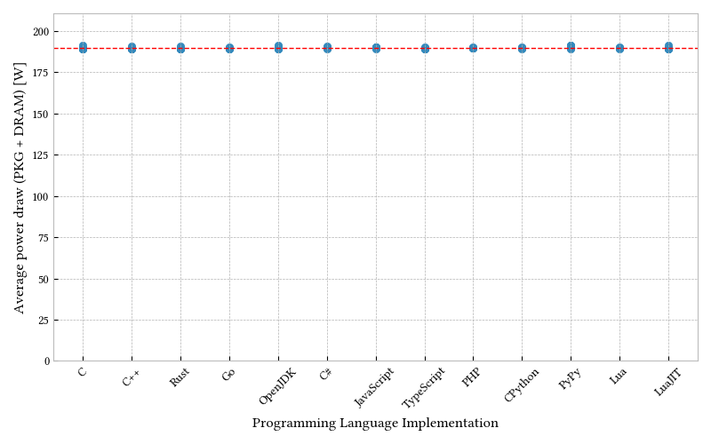

# Energy Efficiency in Programming Languages

[Nicolas van Kempen](https://nvankempen.com),
Hyuk-Je Kwon,
Dung Tuan Nguyen,
[Emery Berger](https://emeryberger.com).

## Documentation

### Requirements

Running the measurement tool requires:
 -  an Intel processor with RAPL support.
 -  Linux (tested on Ubuntu 22.04).

### Docker

The easiest way to run these benchmarks is using Docker:
```bash
% sudo modprobe msr # Enable msr kernel module.
% sudo python3 -m scripts.build_docker_image
% sudo docker run --privileged -v [OUTPUT_DIRECTORY]:/root/data energy-languages [OPTIONS]
```

Here is an example running all languages/benchmarks pairs:
```bash
% sudo docker run -it --rm --privileged -v `pwd`/data/`hostname -s`/docker-default:/root/data energy-languages \
    --languages C C++ Rust Go Java C\# JavaScript TypeScript PHP Python PyPy Lua LuaJIT \
    --warmup 1 \
    --iterations 21 \
    --timeout 10000
```

Running additional experiments:
```bash
% sudo docker run -it --rm --privileged -v `pwd`/data/`hostname -s`/docker-default:/root/data energy-languages \
    --benchmark-root experiments \
    --languages "C as C++" "Go-no-GC" "JavaScript as TypeScript" \
    --warmup 1 \
    --iterations 21 \
    --timeout 10000
```

Running Java-N experiments:
```bash
% sudo ./scripts/docker-java-n.sh Java docker-default
```

Processors can be set to their minimum frequency with the following commands:
```bash
# Use frequency-info to check the defaults for your machine.
% cpupower frequency-info

# Pin to lowest possible frequency.
% echo 1 | sudo tee /sys/devices/system/cpu/intel_pstate/no_turbo
% sudo cpupower frequency-set --governor powersave
% sudo cpupower frequency-set --max 800Mhz

# Restore defaults after running experiments.
% echo 0 | sudo tee /sys/devices/system/cpu/intel_pstate/no_turbo
% sudo cpupower frequency-set --governor powersave
% sudo cpupower frequency-set --max 3.4GHz
```

Finally, experiments can be pinned to a single code by using Docker's
`--cpuset-cpus` option, specifying a core number. For example:
```bash
% sudo docker run -it --rm --privileged --cpuset-cpus=13 [...]
```

## Figures

### Average power draw as a function of the average number of cores used



```bash
% python3 -m scripts.normalize_cores \
    --data-root data/`hostname -s`/docker-default \
    --languages C C++ Rust Go Java C\# JavaScript TypeScript PHP Python PyPy Lua LuaJIT
```

### Average power draw as a function of memory activity



```bash
% python3 -m scripts.dram \
    --data-root data/`hostname -s`/docker-default \
    --languages C C++ Rust Go Java C\# JavaScript TypeScript PHP Python PyPy Lua LuaJIT
```

### Average power draw controlling for external factors



```bash
% python3 -m scripts.fixed_time \
    --data-root data/`hostname -s`/docker-min-freq-cpuset-13 \
    --languages C C++ Rust Go Java C\# JavaScript TypeScript PHP Python PyPy Lua LuaJIT
```

### Other

A few other scripts can be useful to generate figures and results.
Their options are self-explanatory and/or documented in the `--help` message.
Notably:
 -  `scripts.table`: Build two tables comparing runtime and energy
    consumption for a list of languages.
 -  `scripts.barchart`: Compare two implementations of the same programming
    language.
 -  `scripts.java_n`: Generate a figure for a given benchmark of time per
    iteration as a function of number of iterations.

## License

The original benchmark suite, the
[Computer Language Benchmark Game](https://benchmarksgame-team.pages.debian.net/benchmarksgame/),
is under
[BSD-3-Clause](https://salsa.debian.org/benchmarksgame-team/benchmarksgame/-/blob/c68e92512e8076c72c6b9fd207e777b5ac1a87ef/LICENSE.md).

Code from
[the repository this one originally forked from](https://github.com/greensoftwarelab/Energy-Languages)
is under
[MIT](https://github.com/greensoftwarelab/Energy-Languages/blob/1356528173d6bb07fb2512037c0ed8e2279ce440/LICENSE).

Any other code in this repository is under [Apache-2.0](LICENSE).
